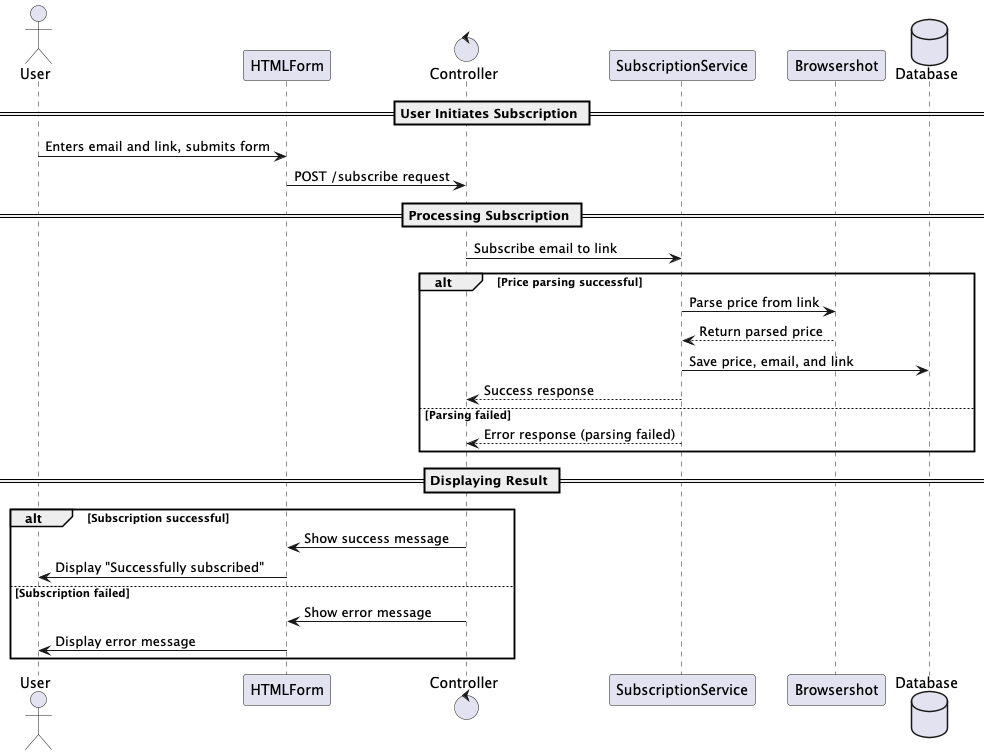
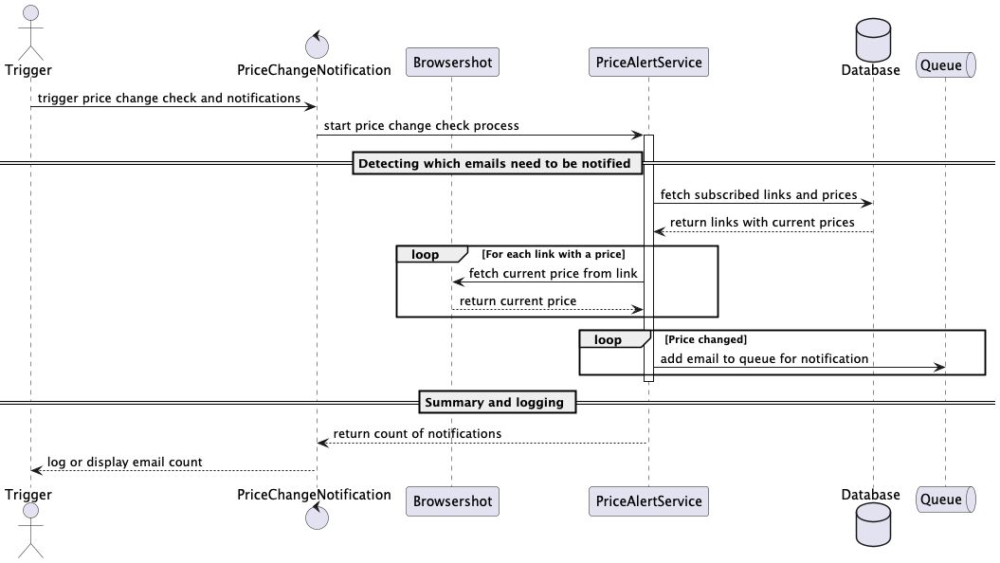

# Price Change Notification System

## Overview

**Price Change Notification System** is a Laravel-based project that allows users to subscribe to price changes for
items on external websites. The application periodically checks prices and sends notifications via email when a price
change is detected.

## Features

- User subscription to item price alerts
- Automatic price checking at scheduled intervals
- Email notifications to subscribers when prices change
- Queue support for asynchronous email sending
- Integration with external services for price parsing

## Installation

### Installation Steps

1. **Clone the repository:**
   ```bash
   git clone https://github.com/Predator051/olx-price-viewer
   cd olx-price-viewer

2. **Create a .env file and configure it:**
   ```bash
   cp .env.example .env

3. **Docker build:**
   ```bash
   docker compose up -d --build

4. **Enter to docker:**
   ```bash
   docker compose exec php bash
    ```
    1. **Grants:**
       ```bash
       chown -R www-data:www-data /var/www/storage /var/www/bootstrap/cache
       chmod -R 775 /var/www/storage /var/www/bootstrap/cache

    2. **Composer setup**
       ```bash
       composer setup

## Using

Use http://localhost:8080/ for interacting with user interface

---

## Process Overview

Subscription Process
When a user subscribes to a product, their email and the product link are saved in the database along with the initial
price.



## Price Check Process

A background process periodically fetches prices for all subscribed links. If a price change is detected, subscribers
are notified by email.



---

## Conclusion

In this project, we chose to store prices as raw strings (e.g., `100 грн`, `$100`) without parsing or converting them to
a unified format. This approach simplifies the storage and comparison of prices, which is ideal for use cases focused on
price change notifications rather than detailed currency analysis.

Other approaches were considered, including:

- **Separating currency and price values** — storing numeric values separately from the currency symbols for easier data
  processing.
- **Converting all prices to a unified currency** (e.g., USD) — to standardize values across multiple currencies for
  consistent analysis.

Ultimately, storing prices as strings was selected as it minimizes complexity, reduces dependencies, and allows us to
handle a variety of price formats directly from the source. This choice enables flexibility and straightforward
comparisons, which aligns well with our main goal of tracking and notifying price changes.

## Coverage report

Report is in /build/coverage folder.
Currently, it's about 96.3%

